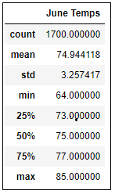
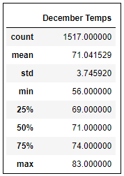

# Surfs Up

## Project Overview
Vacation are rejuvenating, no doubt. But they can also change your lives forever. I say this becasue it happened to me. Last year, I went to Hawaii, and discovered a newfound passion for Surfing. I was planning something that will allow me not just to return to Hawaii but live there forever. I finally came up with an idea - A ***Surf n'Shake*** shop serving surfboards and ice cream to locals, tourists, and myself. 

I have some savings from my career as a Data Analyst, but I will need some real investor backing to get this off the ground. So after putting together a strong business plan, I reached out to an investor ***W.Avy*** who is famous for his love of surfing. My first meeting with him goes extremely well but he has one concern. What about the weather? He's extremely serious about this. He invested in a surf shop early in this career, however, he didn't ask for any weather analysis and that early venture was rained out of existence. W.Avy knows my career as a Data Analyst, so asks whether I can run some analytics on a weather dataset he has from the very island where I want to open my shop: ***O'ahu***. 

And my answer - Will do !

## Purpose of this Analysis

In the past, I have shared some analysis and graphs with W.Avy.

W. Avy liked the analysis, but he wants more information about temperature trends before opening the surf shop. Specifically, he wants temperature data for the months of June and December in O'ahu, in order to determine if the surf and ice cream shop business is sustainable year-round.

## Analysis Steps

1. In Step 1, write a query that filters the `date` column from the `Measurement` table to retrieve all the temperatures for the month of June.
2. In Step 2, convert the June temperatures to a list.
3. In Step 3, create a DataFrame from the list of temperatures for the month of June.
4. In Step 4, generate the summary statistics for the June temperatures DataFrame.

    **Image 1 (below): Summary - June Temperature**

    

5. In Step 5, write a query that filters the `date` column from the `Measurement` table to retrieve all the temperatures for the month of December.
6. In Step 6, convert the December temperatures to a list.
7. In Step 7, create a DataFrame from the list of temperatures for the month of December.
8. In Step 8, generate the summary statistics for the December temperatures DataFrame.

    **Image 2 (below): Summary - December Temperature**

    

## Analysis Results

Hawaii has a tropical climate, which means there isn't as big a difference in the temperature around the year as compared to other states in the U.S.

Below are some differences in weather between June and December
1. The difference in the maximum temperature is 2 degrees - with June at 85°F and Dec at 83°F

2. The mean temperature of June is 75°F and that of December is 71°F

3. The Standard deviation of June temperature is 3.26°F which is less than the Standard Deviation of December wich is 3.75°F. Smaller standard deviation means that the June temperatures are closer to the mean as comapred to the December average. This combined with almost 200 more temperature counts for June means we can trust the values of June more than 

There is a bulleted list that addresses the three key differences in weather between June and December. (6 pt)

## Summary

There is a high-level summary of the results and there are two additional queries to perform to gather more weather data for June and December. (5 pt)
